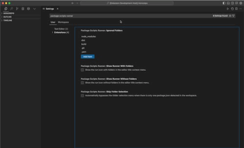

# Package Scripts Runner

Extension that allows users to easily run scripts defined in the package.json files of their workspace folders, including subrepositories. It detects the package manager (npm, pnpm, or yarn) used in each folder and provides a quick pick menu to select a folder and a script to run.

## Supported Folder Structures

This extension supports running scripts from the root level `package.json` file as well as from `package.json` files in immediate subfolders (1 level deep). It does not currently support running scripts from `package.json` files nested more than 1 level deep.

## Features

- Running scripts with folder selection in a monorepo, `package.json` files in the root and subfolders

- Running scripts without folder selection, `package.json` files in the root and subfolders

- Accessing both commands through buttons in the upper right menu (`needs to be set in extension settings`)

## Extension Settings

This extension contributes the following settings:

* `packageScriptsRunner.ignoredFolders`: Folders not to be scanned for `package.json` file.
* `packageScriptsRunner.showRunnerWithFolders`: Show/hide button in upper right corner for running scripts with folder selection.
* `packageScriptsRunner.showRunnerWithoutFolders`: Show/hide button in upper right corner for running scripts without folder selection.
* `packageScriptsRunner.skipFolderSelection`: Automatically bypasses the folder selection menu when there is only one package.json detected in the workspace.

## Release Notes

### 1.0.0

Initial release.
